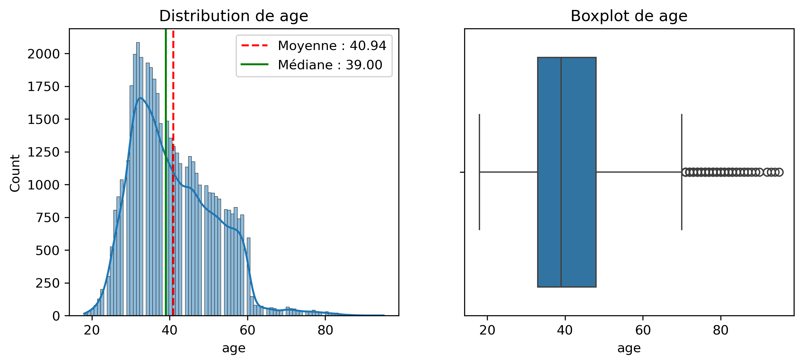
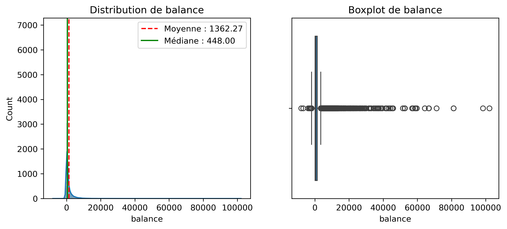
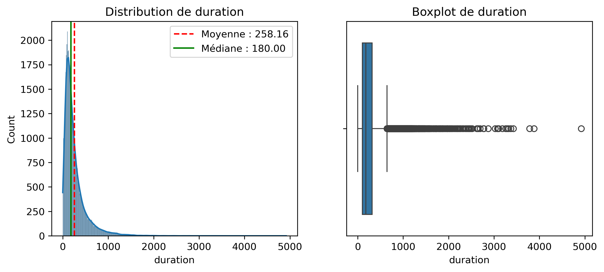

# Validation des données — Bank Marketing (bank-full.csv)

Projet de validation et contrôle qualité des données sur le dataset **Bank Marketing** (campagnes de télémarketing bancaire).
Notebook Jupyter documentant l’analyse, la détection d’anomalies et la validation par règles métier.

## Objectif / Contexte

L’objectif est de garantir la **fiabilité** d’un jeu de données avant analyse ou modélisation :
- comprendre la structure des variables (numériques et catégorielles),
- détecter et documenter les anomalies (valeurs manquantes, incohérences, types, doublons, outliers),
- appliquer des **règles métier** et valider automatiquement la conformité.

Ce travail est intéressant car en data science, une grande partie des erreurs de modèle provient de **données incohérentes ou mal comprises** : la validation réduit ces risques et rend l’analyse reproductible.

## Données

**Source**  
UCI Machine Learning Repository — *Bank Marketing* (Moro, Rita, Cortez, 2014)  
DOI : 10.24432/C5K306  
Licence : CC BY 4.0

**Taille du dataset**  
- 45 211 lignes (observations)  
- 17 colonnes au total (16 variables explicatives + 1 cible `y`)

**Variables principales (exemples)**  
- Variables client : `age`, `job`, `marital`, `education`  
- Variables financières : `balance`, `housing`, `loan`, `default`  
- Marketing / contact : `contact`, `day`, `month`, `duration`, `campaign`  
- Historique : `pdays`, `previous`, `poutcome`  
- Cible : `y` (souscription au dépôt à terme : yes/no)

## Méthodologie / Analyse

Le notebook suit un pipeline de validation documenté :

1. **Chargement & description**
   - import du dataset, inspection de la forme, dictionnaire des variables

2. **Statistiques descriptives**
   - tendances centrales, dispersion, relations entre variables
   - visualisations (histogrammes, boxplots, etc.)

3. **Détection des anomalies**
   - valeurs manquantes
   - doublons (si présents)
   - types et formats
   - incohérences logiques
   - valeurs aberrantes (outliers)

4. **Validation contextuelle (règles métier)**
   - définition de règles métier pertinentes
   - validation automatisée via **Pandera** (schema + checks)

## Résultats clés

Principaux constats issus de l’exploration et de la validation :

1. Le dataset peut être validé de façon structurée via un enchaînement : descriptif → anomalies → règles métier.
2. Les modalités **"unknown"** présentes dans certaines colonnes catégorielles doivent être interprétées comme information “non renseignée / non connue” et traitées explicitement (ex. regroupement, imputation, ou exclusion selon le contexte).
3. Plusieurs variables numériques présentent des distributions asymétriques et/ou des valeurs extrêmes (outliers), ce qui peut influencer les analyses et nécessite des choix (ex. transformation, winsorisation, robust scaling).
4. Les règles métier contrôlées (cohérences logiques et bornes réalistes) permettent de renforcer la confiance dans le dataset avant modélisation.

### Visuels – distributions et détection des valeurs aberrantes

Les figures ci-dessous illustrent, pour chaque variable numérique du jeu de données Bank Marketing,
la distribution des valeurs à l’aide d’histogrammes (avec estimation de densité) ainsi que la
détection des valeurs aberrantes à l’aide de boxplots.

Ces visualisations permettent :
- d’analyser la forme des distributions (symétrie, asymétrie) ;
- d’évaluer la dispersion des données ;
- d’identifier la présence d’outliers susceptibles d’influencer les analyses statistiques
  et les modèles ultérieurs.

#### Exemples de visuels générés

## Technologies utilisées

- Python
- pandas, numpy
- matplotlib, seaborn
- scipy (statistiques)
- Jupyter Notebook
- pandera (validation par schéma et checks)

## Auteur

- Nom : Thierry ZOKOU
- GitHub : https://github.com/tzokou
- LinkedIn : https://www.linkedin.com/in/thierry-pascal-zokou-tchokonthe-b46655184/
